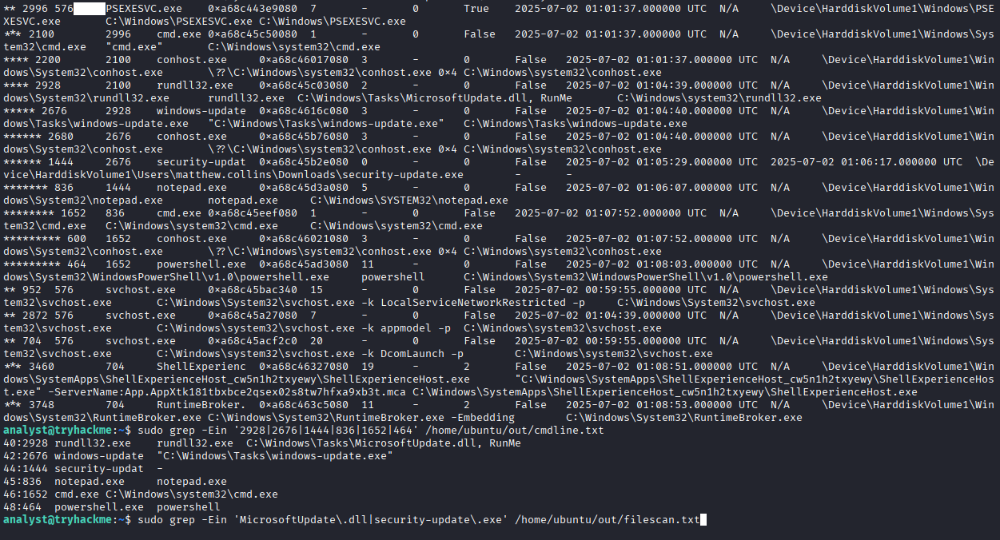
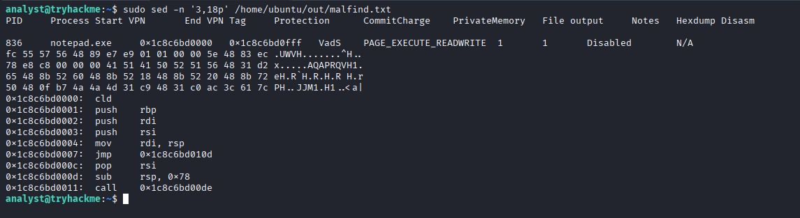
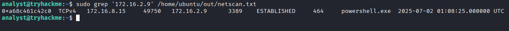
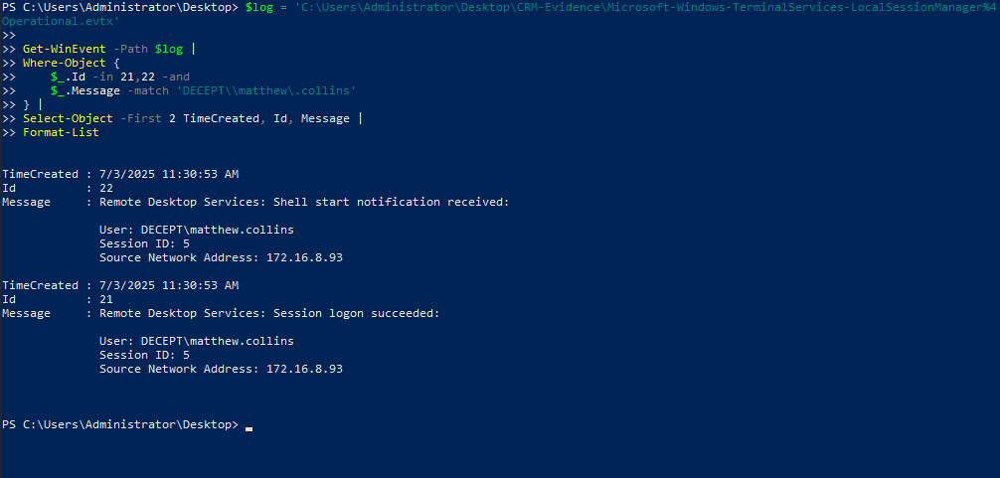
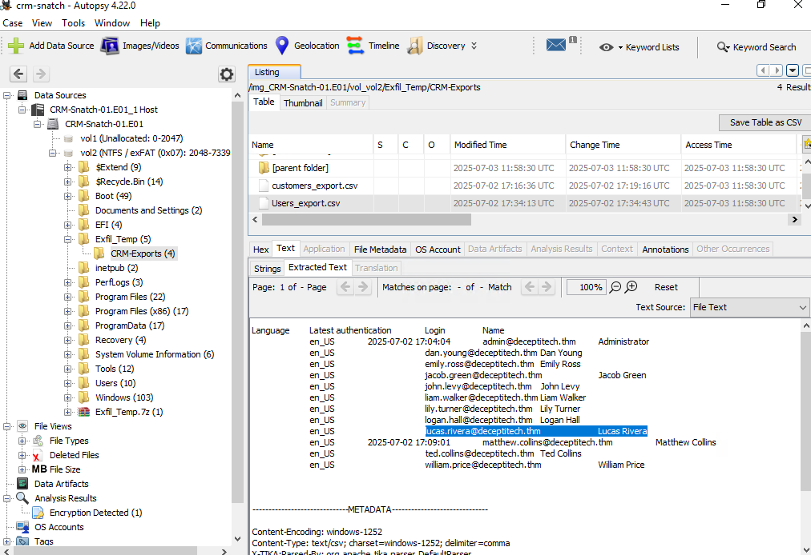

# Enterprise DFIR Investigation

## Executive Summary

This project documents a multi-host digital forensics and incident response investigation conducted in a simulated enterprise environment. The investigation began with the compromise of an internet-facing WordPress server and followed the attacker's activity across multiple Linux and Windows systems.

Evidence from web logs, Linux audit records, Windows forensic artifacts, PowerShell transcripts, and volatile memory was correlated to reconstruct the intrusion from initial access through privilege escalation, credential access, persistence, and lateral movement.

Key findings included WordPress administrative compromise, webshell deployment, reverse-shell activity, Linux persistence, abuse of stolen domain credentials, scheduled-task manipulation, executable masquerading, LSASS credential dumping, PsExec-based movement, suspicious DLL execution, process injection, and subsequent RDP activity.

The purpose of this project is to demonstrate evidence-driven intrusion reconstruction across multiple hosts while clearly separating directly observed artifacts from conclusions that could not be fully established with the available telemetry.

## Investigation Scope

The investigation focused on four systems representing successive stages of the intrusion:

| System | Investigation Focus |
| --- | --- |
| DeceptiPot | Internet-facing WordPress compromise, Linux execution, privilege escalation, reconnaissance, and persistence |
| SRV-IT-QA | RDP access, scheduled-task abuse, executable masquerading, credential dumping, and lateral movement |
| SRV-DMZ-GW | Process-chain reconstruction, suspicious DLL execution, process injection, memory forensics, and outbound lateral movement |
| SRV-CRM-01 | RDP access and CRM-related data artifacts |

The investigation was performed as a simulated DFIR exercise. Findings are presented as an analyst case study rather than as a walkthrough of the original training material.

Only activity supported by the preserved evidence is treated as confirmed. Where the scenario suggested additional attacker behavior that could not be independently verified from the available artifacts, that limitation is documented explicitly.

## Environment and Evidence Sources

The investigation required analysis across both Linux and Windows systems using multiple forensic data sources.

### Linux Evidence

Evidence from the initial Linux compromise included:

- Apache access logs
- Linux Audit Framework (`auditd`) records
- shell and command-history artifacts
- filesystem artifacts
- systemd service configuration
- WordPress-related files and application activity

These sources were used to correlate attacker-controlled web requests with host-level command execution, reverse-shell activity, privilege escalation, internal reconnaissance, and persistence.

### Windows Evidence

Subsequent Windows investigations used artifacts including:

- Windows event data
- PowerShell transcripts
- Prefetch artifacts
- filesystem metadata
- executable metadata
- process and command-line evidence
- volatile memory captures

These sources were used to investigate remote access, credential access, masqueraded executables, lateral movement, suspicious process ancestry, and memory-resident activity.

### Memory Forensics

Volatile memory analysis was performed with Volatility to examine:

- running processes
- parent-child process relationships
- command-line arguments
- network connections
- suspicious executable memory regions
- injected shellcode

Memory analysis was particularly important when investigating activity on `SRV-DMZ-GW`, where process injection and memory-resident payload behavior were identified.

### Investigation Approach

The investigation followed an evidence-first workflow:

1. Identify suspicious activity within the available artifact set.
2. Correlate related events across logs, processes, files, and network evidence.
3. Reconstruct the sequence of attacker actions.
4. Validate findings using independent artifacts where possible.
5. Record limitations when the evidence did not support a definitive conclusion.

This approach was used throughout the investigation to avoid treating scenario context or assumptions as independently verified forensic findings.

## Attack Overview

The intrusion progressed from compromise of an internet-facing Linux web application into the internal Windows environment. After establishing command execution and persistent root-level access on `DeceptiPot`, the attacker used compromised credentials to access `SRV-IT-QA`, performed credential dumping, and continued lateral movement with PsExec.

Volatile-memory analysis on `SRV-DMZ-GW` later identified suspicious DLL execution, process injection, Meterpreter-like shellcode, and an established RDP connection leading deeper into the environment. The final preserved evidence showed access to `SRV-CRM-01`, a system containing sensitive CRM-related data.

```text
Internet
   ↓
DeceptiPot
WordPress → Webshell → Reverse Shell → Root → Persistence
   ↓
SRV-IT-QA
RDP → Masquerading → LSASS Dump → PsExec
   ↓
SRV-DMZ-GW
DLL Execution → Process Injection → Meterpreter → RDP
   ↓
SRV-CRM-01
RDP → CRM Data Access
```

The sections below examine each stage using the preserved forensic evidence.

## Stage 1 — Initial Access and Linux Compromise

The intrusion began against `DeceptiPot`, an internet-facing Linux system hosting a WordPress application. Web-server logs, Linux audit records, shell artifacts, and filesystem evidence were correlated to reconstruct the attack from initial access through root-level persistence.

### WordPress Brute Force

Review of the Apache access logs identified repeated authentication activity directed at the WordPress login interface.

The request pattern was consistent with automated password guessing and showed repeated attempts against the administrative login endpoint. The activity was associated with external infrastructure later tied to the intrusion.

This established the likely initial-access path:

```text
External attacker
      ↓
WordPress login attempts
      ↓
Successful administrative access
```

The authentication activity alone did not prove host compromise. Subsequent WordPress and operating-system evidence was required to establish that the attacker progressed beyond account access.


*Figure 1 — Apache access-log evidence showing repeated authentication activity against the WordPress application.*

### Webshell Deployment

Following the WordPress compromise, activity shifted from authentication attempts to administrative functions capable of modifying application files.

Web-server evidence showed interaction with WordPress functionality associated with modifying PHP content. A PHP-based webshell was subsequently identified within the application environment.

This represented the transition from compromised application credentials to arbitrary command execution on the underlying host.

```text
Compromised WordPress administrator
        ↓
Application file modification
        ↓
PHP webshell
        ↓
Operating-system command execution
```

Web-request evidence was correlated with Linux audit records to validate that attacker-controlled requests resulted in processes being launched on the server.


*Figure 2 — WordPress activity associated with the deployment and use of the PHP webshell.*

### Web-to-Host Execution Correlation

One of the strongest findings in the Linux investigation was the ability to correlate application-layer activity with host-level execution.

Suspicious HTTP requests contained attacker-controlled command input. Corresponding `auditd` records showed execution of the associated operating-system commands.

This provided independent evidence that the malicious web activity was not limited to requests reaching the application; the commands were executed by the host.

```text
Malicious HTTP request
        ↓
WordPress / PHP processing
        ↓
auditd EXECVE event
        ↓
Host command execution
```

This distinction was important because a malicious request alone does not establish successful command execution.


*Figure 3 — Web and Linux audit evidence correlating attacker-controlled application activity with host-level command execution.*

### Reverse Shell Establishment

Host telemetry later showed use of `socat`, a networking utility capable of establishing bidirectional connections and interactive shells.

The observed execution was consistent with the attacker upgrading webshell-style access into an interactive reverse shell.

This provided a more flexible foothold on the server and enabled additional host discovery and privilege-escalation activity.

```text
Webshell access
      ↓
socat execution
      ↓
Interactive reverse shell
```

Because `socat` is a legitimate administration and networking utility, its presence alone was not treated as malicious. Its significance came from the surrounding compromise context and execution sequence.


*Figure 4 — Host evidence showing `socat` activity associated with establishment of an interactive reverse shell.*

### Privilege Escalation

The investigation identified an exposed SSH private key that could be used to obtain higher-privileged access.

Subsequent shell artifacts indicated that the attacker transitioned into a root-level context. This expanded the compromise from application-level and user-level execution to full administrative control of the Linux host.

```text
Initial shell
      ↓
Credential / key discovery
      ↓
SSH private-key access
      ↓
Root-level session
```

The investigation treated the exposed key as credential material rather than a software-exploitation vulnerability. No evidence was identified showing that the attacker required exploitation of a kernel or application vulnerability to obtain root privileges.


*Figure 5 — Root-level shell activity following credential discovery, with subsequent reconnaissance of the internal environment.*

### Internal Reconnaissance

After obtaining elevated privileges, the attacker performed reconnaissance against the surrounding environment.

Observed activity included host and network discovery intended to identify additional reachable systems and services.

This marked the transition from compromise of the internet-facing host toward lateral movement deeper into the environment.

```text
Compromised DeceptiPot
        ↓
Network reconnaissance
        ↓
Identification of internal targets
```

The reconnaissance was significant because the following stages of the investigation involved Windows systems that were not directly internet-facing.

### Payload Retrieval

The attacker retrieved additional tooling after establishing elevated access.

Artifacts indicated that external content was downloaded to the compromised system for use in later stages of the intrusion.

The investigation separated payload retrieval and placement from later execution rather than assuming that the presence of a downloaded file proved it had run.

### Linux Persistence

Persistent access was established through a malicious systemd service designed to resemble a legitimate Linux kernel worker.

The service referenced an attacker-controlled executable and was configured so the malicious program could launch automatically with the system.

```text
systemd
   ↓
trusted-looking service name
   ↓
attacker-controlled executable
   ↓
automatic execution
```

This represented a durable foothold independent of the original WordPress access path.

Persistence through systemd is especially significant because service execution may occur with elevated privileges and survive user logoff or system restart.


*Figure 6 — Malicious systemd configuration establishing persistent execution of attacker-controlled tooling.*

### Stage 1 Findings

The Linux investigation established the following sequence with supporting evidence:

1. Repeated authentication activity targeted the exposed WordPress application.
2. Administrative WordPress access enabled modification of application content.
3. A PHP webshell provided operating-system command execution.
4. Web requests were correlated with `auditd` records to confirm host execution.
5. `socat` was used to establish interactive remote access.
6. Exposed credential material enabled escalation to a root-level context.
7. The compromised server was used to perform internal reconnaissance.
8. Additional attacker tooling was retrieved.
9. A malicious systemd service established persistent access.

By the end of this stage, the attacker had progressed from an internet-facing web application to persistent root-level access on the Linux host and had begun identifying targets inside the enterprise network.

## Stage 2 — Credential Access and Windows Lateral Movement

Following compromise of the internet-facing Linux host, the investigation shifted to `SRV-IT-QA`, a Windows system inside the enterprise environment.

Forensic artifacts indicated that previously obtained domain credentials were used to access the server through Remote Desktop Protocol (RDP). Subsequent activity included scheduled-task abuse, execution of a masqueraded binary, credential dumping from LSASS, and PsExec-based lateral movement.

### RDP Access with Stolen Credentials

Evidence on `SRV-IT-QA` showed an interactive RDP session associated with the domain account:

```text
DECEPT\emily.ross
```

The activity was consistent with the attacker using credentials obtained during the earlier stages of the intrusion to move from the compromised Linux system into the Windows environment.

```text
Linux foothold
      ↓
Credential access
      ↓
Valid domain account
      ↓
RDP authentication
      ↓
SRV-IT-QA
```

Rather than exploiting a remote software vulnerability, the attacker was able to access the Windows server using legitimate authentication mechanisms and compromised credentials.


*Figure 7 — Forensic evidence showing interactive RDP access to `SRV-IT-QA` using the compromised domain account `DECEPT\emily.ross`.*

### Scheduled Task Abuse

Investigation of activity on `SRV-IT-QA` identified suspicious use of Windows scheduled tasks.

The attacker manipulated scheduled execution in order to launch a binary from the compromised user environment.

Scheduled tasks are legitimate Windows administration mechanisms, but they can also provide attackers with a reliable method of executing code automatically or under a desired security context.

The significance of the activity came from the relationship between the scheduled task, the affected user, and the executable it launched rather than from the use of Task Scheduler alone.

### Executable Masquerading

One of the key artifacts identified on the system was:

```text
C:\Users\emily.ross\Documents\Coreinfo64.exe
```

The filename suggested that the executable was the legitimate Microsoft Sysinternals `Coreinfo64.exe` utility.

Inspection of the executable metadata, however, revealed conflicting information:

```text
FileDescription: ApacheBench command line utility
ProductName: Apache HTTP Server
OriginalFilename: ab.exe
```

The mismatch between the visible filename and the executable's embedded metadata indicated that the file had been renamed to resemble a trusted administrative utility.

This is consistent with executable masquerading, where an attacker attempts to reduce suspicion by assigning malicious or unauthorized tooling a familiar name.


*Figure 8 — The file named `Coreinfo64.exe` contained embedded metadata identifying it as ApacheBench (`ab.exe`), indicating executable masquerading.*

### Execution Validation with Prefetch

The presence of a suspicious executable on disk did not by itself prove that the program had executed.

Windows Prefetch artifacts were therefore examined to determine whether the masqueraded `Coreinfo64.exe` binary had actually run.

Prefetch evidence confirmed execution of the file on `SRV-IT-QA`.

This provided independent validation that the suspicious file was not merely present on disk but had executed.

### PowerShell Activity

PowerShell transcript evidence revealed additional attacker activity following execution on the server.

The transcripts provided command-level visibility that could not be obtained from filenames alone and showed the attacker interacting directly with the Windows environment.

Of particular importance was activity involving Sysinternals ProcDump and the Local Security Authority Subsystem Service (`lsass.exe`).

### LSASS Credential Dumping

The PowerShell evidence showed use of ProcDump against the LSASS process.

LSASS maintains sensitive authentication material for active Windows logon sessions. Accessing or dumping its memory can expose credentials or credential-derived material that may enable further lateral movement.

```text
PowerShell
    ↓
ProcDump
    ↓
lsass.exe
    ↓
LSASS memory dump
    ↓
Credential-access opportunity
```

The presence of the ProcDump command and associated dump activity supported the conclusion that credential access was a primary objective on `SRV-IT-QA`.


*Figure 9 — PowerShell transcript evidence showing ProcDump targeting `lsass.exe`, consistent with credential-dumping activity.*

### Credential Dump Retrieval

Artifacts indicated that the resulting credential dump was subsequently accessed or retrieved for further use.

The investigation treated creation of the LSASS dump and subsequent handling of the resulting artifact as separate actions rather than assuming how the recovered credential material was ultimately used.

### PsExec Lateral Movement

Evidence later showed use of PsExec, a legitimate Sysinternals remote-administration utility commonly used to execute processes on remote Windows systems.

Within the context of the ongoing compromise, PsExec activity represented another lateral-movement mechanism.

```text
Stolen domain credentials
        ↓
RDP to SRV-IT-QA
        ↓
Scheduled-task abuse
        ↓
Masqueraded executable
        ↓
PowerShell activity
        ↓
LSASS credential dumping
        ↓
PsExec
        ↓
Movement toward SRV-DMZ-GW
```

As with other dual-use administrative tools observed during the investigation, PsExec was not classified as malicious solely because of its presence. Its significance was established through its timing, execution context, and relationship to the larger intrusion sequence.


*Figure 10 — Evidence of PsExec activity used to continue lateral movement from `SRV-IT-QA` toward another internal Windows system.*

### Stage 2 Findings

The `SRV-IT-QA` investigation established the following findings:

1. A compromised domain identity was used to obtain interactive RDP access to the Windows server.
2. Scheduled-task functionality was abused to support attacker-controlled execution.
3. A binary named `Coreinfo64.exe` contained metadata identifying it as a different application, providing evidence of executable masquerading.
4. Windows Prefetch artifacts independently confirmed that the masqueraded executable executed.
5. PowerShell transcript evidence showed ProcDump targeting `lsass.exe`.
6. LSASS memory was dumped, creating an opportunity for additional credential theft.
7. PsExec activity provided evidence of lateral movement toward `SRV-DMZ-GW`.

By the end of Stage 2, the intrusion had progressed from the initial Linux foothold into the Windows domain environment, where the attacker obtained additional credential material and established the access required to continue moving between internal systems.

## Stage 3 — Memory Forensics and Continued Lateral Movement

The investigation then moved to `SRV-DMZ-GW`, where volatile memory analysis was used to reconstruct attacker activity that was not fully explained by disk artifacts alone.

A memory image from the system was analyzed with Volatility to examine process relationships, command-line activity, loaded modules, suspicious executable memory, and active network connections.

This stage was particularly important because it exposed evidence of in-memory execution, process injection, and continued lateral movement.

### Process Tree Reconstruction

Initial process analysis revealed a suspicious execution chain originating from PsExec activity.

```text
PSEXESVC.exe
      ↓
cmd.exe
      ↓
rundll32.exe
      ↓
MicrosoftUpdate.dll
      ↓
windows-update.exe
      ↓
security-update.exe
      ↓
notepad.exe
      ↓
cmd.exe
      ↓
powershell.exe
```

Rather than treating each executable independently, the investigation used parent-child process relationships to reconstruct the likely execution sequence.



*Figure 11 — Volatile-memory process analysis showing the suspicious execution chain beginning with PsExec activity and continuing through `rundll32.exe`, update-themed payloads, `notepad.exe`, and command-line processes.*

### Suspicious DLL Execution

Within the process tree, `rundll32.exe` was observed loading:

```text
MicrosoftUpdate.dll
```

The DLL name resembled legitimate Microsoft update-related software.

Because `rundll32.exe` is a legitimate Windows utility capable of executing exported functions from DLL files, its use is not inherently malicious. In this case, its significance came from its placement inside the broader suspicious process chain.

### Masqueraded Update Payloads

Additional executables observed in memory used update-themed filenames:

```text
windows-update.exe
security-update.exe
```

Within the context of the existing intrusion, the naming pattern was treated as evidence of masquerading rather than proof that the files were legitimate Microsoft components.

This reinforced a recurring theme from Stage 2: filenames and visible process names cannot be trusted as sole indicators of software identity.

### Process Injection

Memory analysis of `notepad.exe` identified suspicious executable memory that did not match the expected behavior of a normal text editor process.

Volatility's `malfind` analysis identified memory regions with permissions consistent with executable injected code.

The suspicious region included a shellcode-like byte sequence beginning with:

```text
fc 55 57 56 48 ...
```

The presence of executable memory inside `notepad.exe`, combined with the surrounding attack chain, was consistent with process injection.



*Figure 12 — Volatility `malfind` output identifying suspicious executable memory inside `notepad.exe`, consistent with injected shellcode.*

### Meterpreter Identification

The suspicious memory content was consistent with Meterpreter-related shellcode.

Meterpreter is commonly used as an interactive post-exploitation payload and can operate primarily in memory, reducing reliance on obvious executable files on disk.

The identification of Meterpreter-like shellcode inside `notepad.exe` supported the conclusion that the attacker had established an in-memory post-exploitation session.

### Command Execution from the Injected Context

The process chain following `notepad.exe` included:

```text
notepad.exe
    ↓
cmd.exe
    ↓
powershell.exe
```

This suggested that the injected process context was being used to launch additional command-line activity.

The presence of both `cmd.exe` and `powershell.exe` under the suspicious process chain provided additional evidence that the compromised process was being used interactively rather than simply containing dormant injected code.

### Network Connection Analysis

Volatility network analysis identified an established RDP connection associated with `powershell.exe`.

```text
172.16.8.15:49750
        →
172.16.2.9:3389
```

The connection was in an established state and associated with:

```text
powershell.exe
PID 464
```

Because TCP/3389 is associated with Remote Desktop Protocol, the connection indicated movement from `SRV-DMZ-GW` toward another internal Windows host.



*Figure 13 — Volatility network analysis showing an established connection from the compromised host to TCP/3389 on another internal system, supporting continued lateral movement.*

### Continued Lateral Movement

Combining process and network evidence produced the following progression:

```text
PsExec access
      ↓
PSEXESVC.exe
      ↓
rundll32.exe
      ↓
Suspicious DLL execution
      ↓
Masqueraded update payloads
      ↓
notepad.exe
      ↓
Injected Meterpreter-like shellcode
      ↓
cmd.exe / powershell.exe
      ↓
Established RDP connection
      ↓
Movement toward another internal host
```

The memory evidence therefore demonstrated that the attacker was not simply present on `SRV-DMZ-GW`; the system was actively being used as another point of access for continued movement through the environment.

### Stage 3 Findings

The volatile-memory investigation established the following findings:

1. PsExec-related execution was followed by a suspicious chain of Windows processes.
2. `rundll32.exe` was used to load a DLL named `MicrosoftUpdate.dll`.
3. Additional binaries used update-themed filenames consistent with masquerading.
4. `notepad.exe` contained suspicious executable memory identified through Volatility `malfind`.
5. The injected memory contained shellcode consistent with Meterpreter-related activity.
6. The suspicious `notepad.exe` process spawned additional command-line activity.
7. `powershell.exe` maintained an established RDP connection to another internal host.
8. The combined memory and network evidence supported continued lateral movement from `SRV-DMZ-GW`.

By the end of Stage 3, memory forensics had exposed attacker activity that would have been difficult to establish through disk artifacts alone, including process injection, in-memory payload execution, and the network connection used to continue the intrusion.

## Stage 4 — CRM Server Compromise

The final preserved stage of the investigation focused on `SRV-CRM-01`, another internal Windows system reached later in the intrusion.

Compared with the earlier stages, the retained evidence for this host was more limited. The available artifacts nevertheless supported two important findings: remote access to the system and the presence of CRM-related data artifacts that were relevant to the attacker's apparent collection objectives.

### RDP Access

Evidence showed an RDP session associated with the domain account:

```text
DECEPT\matthew.collins
```

The source of the connection was:

```text
172.16.8.93
```

This indicated continued movement through the Windows environment using valid domain credentials.

```text
Previously compromised Windows host
        ↓
Valid domain credentials
        ↓
RDP
        ↓
SRV-CRM-01
```

As with the earlier RDP activity, the use of legitimate authentication mechanisms meant that the connection could resemble normal administrative behavior without the surrounding incident context.



*Figure 14 — Evidence of RDP access to `SRV-CRM-01` using the domain account `DECEPT\matthew.collins` from internal host `172.16.8.93`.*

### CRM Data Artifacts

Forensic examination of the system identified CRM-related data artifacts containing customer or business information.

The presence of these artifacts was significant because earlier stages of the intrusion had already demonstrated credential access, lateral movement, internal reconnaissance, and post-compromise execution.

The preserved evidence supports the conclusion that the attacker reached a system containing sensitive CRM data.



*Figure 15 — Forensic evidence showing CRM-related data artifacts present on `SRV-CRM-01`, establishing access to potentially sensitive business information.*

### Evidence Limitations

The training scenario associated this stage with additional activity, including collection, archive staging, exfiltration, and anti-forensic actions.

However, the preserved evidence available for this project does not independently establish all of those actions.

The retained artifacts support:

- RDP access to `SRV-CRM-01`
- use of the `DECEPT\matthew.collins` account
- access to a system containing CRM-related data artifacts

The available evidence does **not** provide enough independent support to make definitive claims about:

- the exact files collected
- the full contents of any archive
- successful external exfiltration
- deletion of Windows event logs
- deletion of Volume Shadow Copies

Those actions are therefore not presented as confirmed findings in this case study.

### Stage 4 Findings

The available evidence supports the following findings:

1. The attacker continued lateral movement to `SRV-CRM-01`.
2. The RDP activity used the domain account `DECEPT\matthew.collins`.
3. The system contained CRM-related data artifacts of potential value to the attacker.
4. The preserved evidence for this stage was insufficient to independently confirm the full collection and exfiltration sequence described by the scenario.

This final stage demonstrates an important forensic principle: conclusions should be limited to what the available evidence can actually support.

## Cross-Host Attack Timeline

The investigation revealed a multi-stage intrusion that moved from an internet-facing Linux application into the internal Windows environment.

| Phase | Host | Activity | Evidence |
| --- | --- | --- | --- |
| Initial Access | DeceptiPot | Repeated authentication attempts targeted the WordPress administrative interface | Apache access logs |
| Application Compromise | DeceptiPot | Administrative access was followed by PHP/webshell activity | WordPress / web-server artifacts |
| Execution | DeceptiPot | Attacker-controlled web requests were correlated with host command execution | Apache logs + `auditd` |
| Command and Control | DeceptiPot | `socat` was used to establish interactive remote access | Linux process / audit evidence |
| Privilege Escalation | DeceptiPot | Exposed credential material enabled transition to a root-level context | SSH key and shell artifacts |
| Discovery | DeceptiPot | Internal network reconnaissance was performed from the compromised host | Shell / command-history evidence |
| Persistence | DeceptiPot | A malicious systemd service established durable execution | systemd configuration |
| Lateral Movement | SRV-IT-QA | Compromised domain credentials were used for RDP access | Windows forensic artifacts |
| Execution | SRV-IT-QA | Scheduled execution launched attacker-controlled tooling | Scheduled-task artifacts |
| Defense Evasion | SRV-IT-QA | `Coreinfo64.exe` masqueraded as a trusted administrative utility | Executable metadata |
| Execution Validation | SRV-IT-QA | Prefetch evidence confirmed the masqueraded executable ran | Windows Prefetch |
| Credential Access | SRV-IT-QA | ProcDump targeted `lsass.exe` to create a credential dump | PowerShell transcript |
| Lateral Movement | SRV-IT-QA | PsExec activity supported movement to another Windows host | Windows process artifacts |
| Remote Execution | SRV-DMZ-GW | PsExec-related execution led into a suspicious process chain | Volatile memory |
| Execution | SRV-DMZ-GW | `rundll32.exe` loaded `MicrosoftUpdate.dll` | Memory process analysis |
| Defense Evasion | SRV-DMZ-GW | Update-themed executables were used to resemble legitimate software | Process / command-line evidence |
| Process Injection | SRV-DMZ-GW | Executable injected memory was identified inside `notepad.exe` | Volatility `malfind` |
| Post-Exploitation | SRV-DMZ-GW | Injected memory was consistent with Meterpreter-related shellcode | Memory analysis |
| Lateral Movement | SRV-DMZ-GW | An established RDP connection targeted another internal Windows host | Volatility network analysis |
| Remote Access | SRV-CRM-01 | `DECEPT\matthew.collins` was used for RDP access | Preserved RDP evidence |
| Data Access | SRV-CRM-01 | CRM-related business data artifacts were identified on the compromised system | Disk-forensic evidence |

The attack demonstrates how an initial compromise of an internet-facing application can develop into an enterprise-wide incident once the attacker obtains privileged credentials and begins using legitimate administrative mechanisms for lateral movement.

Several stages relied on trusted tools or normal operating-system functionality—including RDP, scheduled tasks, ProcDump, PsExec, `rundll32.exe`, and systemd—which reinforced the importance of analyzing behavior and context rather than relying only on binary names or individual events.

## Key Findings

The investigation established several high-confidence findings across the four affected systems:

1. **An internet-facing WordPress compromise resulted in host-level execution.** Apache and `auditd` evidence connected malicious application activity to commands executed on the Linux server.

2. **The attacker established persistent root-level access on the initial host.** Reverse-shell activity, exposed credential material, internal reconnaissance, and malicious systemd persistence were identified.

3. **Compromised credentials enabled movement into the Windows environment.** Valid domain accounts were used for RDP access rather than relying exclusively on additional software exploitation.

4. **Credential access enabled continued lateral movement.** PowerShell transcript evidence showed ProcDump targeting `lsass.exe`, followed by PsExec activity toward another Windows system.

5. **Masquerading was used repeatedly.** Trusted-looking names such as `Coreinfo64.exe`, `MicrosoftUpdate.dll`, and update-themed executables concealed suspicious tooling and execution.

6. **Memory forensics exposed post-exploitation activity not fully represented on disk.** Volatility identified a suspicious process chain, injected executable memory inside `notepad.exe`, Meterpreter-like shellcode, and an established RDP connection.

7. **The attacker reached sensitive internal infrastructure.** Preserved evidence showed RDP access to `SRV-CRM-01` and the presence of CRM-related business data, although the available artifacts did not independently prove the complete exfiltration sequence.

## Investigation Indicators

The following indicators were identified during the investigation. They are specific to the simulated environment and summarize artifacts that helped connect activity across hosts.

### Accounts

| Indicator | Context |
| --- | --- |
| `DECEPT\emily.ross` | Domain account associated with RDP access to `SRV-IT-QA` |
| `DECEPT\matthew.collins` | Domain account associated with RDP access to `SRV-CRM-01` |

### Files and Payloads

| Indicator | Context |
| --- | --- |
| `Coreinfo64.exe` | Masqueraded executable identified on `SRV-IT-QA` |
| `MicrosoftUpdate.dll` | Suspicious DLL executed through `rundll32.exe` on `SRV-DMZ-GW` |
| `windows-update.exe` | Update-themed executable observed in the suspicious memory process chain |
| `security-update.exe` | Additional update-themed executable observed during post-exploitation |

### Processes and Utilities

| Indicator | Context |
| --- | --- |
| `socat` | Used during interactive Linux reverse-shell activity |
| `ProcDump` | Used to create an LSASS memory dump |
| `lsass.exe` | Target of credential-dumping activity |
| `PsExec` / `PSEXESVC.exe` | Used during Windows lateral movement |
| `rundll32.exe` | Used to execute the suspicious DLL |
| `notepad.exe` | Contained suspicious executable memory consistent with process injection |
| `powershell.exe` | Appeared throughout post-compromise execution and lateral movement |

### Network Indicators

| Indicator | Context |
| --- | --- |
| `172.16.8.15:49750` | Source side of established RDP connection identified in memory |
| `172.16.2.9:3389` | Destination of established RDP connection identified in memory |
| `172.16.8.93` | Source associated with later RDP access to `SRV-CRM-01` |
| TCP/3389 | RDP used during multiple lateral-movement stages |

### Persistence Artifacts

| Indicator | Context |
| --- | --- |
| Malicious systemd service | Persistent execution established on the initial Linux host |
| Scheduled-task activity | Used for attacker-controlled execution on `SRV-IT-QA` |

### Analyst Note

These indicators should not be treated as universally malicious outside the context of this investigation.

Utilities such as `socat`, ProcDump, PsExec, PowerShell, and `rundll32.exe` all have legitimate administrative uses. Their significance in this case came from their relationships to compromised accounts, suspicious parent-child process chains, credential access, persistence, and lateral movement.

## MITRE ATT&CK Mapping

The following ATT&CK techniques map directly to behaviors supported by the preserved forensic evidence. The mapping is intentionally limited to techniques that could be reasonably established during the investigation rather than attempting to assign a technique to every observed artifact.

| Tactic | Technique | ID | Evidence from Investigation |
| --- | --- | --- | --- |
| Credential Access | Brute Force: Password Guessing | `T1110.001` | Repeated authentication attempts against the internet-facing WordPress administrative interface |
| Persistence | Server Software Component: Web Shell | `T1505.003` | PHP webshell deployed following WordPress compromise |
| Execution | Command and Scripting Interpreter: Unix Shell | `T1059.004` | Linux shell commands executed following webshell and reverse-shell access |
| Discovery | Network Service Discovery | `T1046` | Internal network reconnaissance performed from the compromised Linux host |
| Persistence / Privilege Escalation | Create or Modify System Process: Systemd Service | `T1543.002` | Malicious systemd service configured for persistent execution |
| Lateral Movement | Remote Services: Remote Desktop Protocol | `T1021.001` | Compromised domain credentials used for RDP access between internal Windows systems |
| Persistence / Execution | Scheduled Task/Job: Scheduled Task | `T1053.005` | Windows scheduled-task functionality abused for attacker-controlled execution |
| Defense Evasion | Masquerading | `T1036` | `Coreinfo64.exe` and update-themed payload names used to resemble legitimate software |
| Execution | Command and Scripting Interpreter: PowerShell | `T1059.001` | PowerShell used during credential access and post-compromise activity |
| Credential Access | OS Credential Dumping: LSASS Memory | `T1003.001` | ProcDump used against `lsass.exe` to create a memory dump |
| Lateral Movement | Remote Services: SMB/Windows Admin Shares | `T1021.002` | PsExec activity supported remote execution and movement between Windows hosts |
| Defense Evasion / Execution | System Binary Proxy Execution: Rundll32 | `T1218.011` | `rundll32.exe` used to execute `MicrosoftUpdate.dll` |
| Defense Evasion / Privilege Escalation | Process Injection | `T1055` | Executable memory and Meterpreter-like shellcode identified inside `notepad.exe` |

### ATT&CK Coverage by Investigation Stage

```text
Stage 1 — DeceptiPot
├── T1110.001  Password Guessing
├── T1505.003  Web Shell
├── T1059.004  Unix Shell
├── T1046      Network Service Discovery
└── T1543.002  Systemd Service

Stage 2 — SRV-IT-QA
├── T1021.001  Remote Desktop Protocol
├── T1053.005  Scheduled Task
├── T1036      Masquerading
├── T1059.001  PowerShell
├── T1003.001  LSASS Memory
└── T1021.002  SMB / Windows Admin Shares

Stage 3 — SRV-DMZ-GW
├── T1021.002  SMB / Windows Admin Shares
├── T1218.011  Rundll32
├── T1036      Masquerading
├── T1055      Process Injection
├── T1059.001  PowerShell
└── T1021.001  Remote Desktop Protocol

Stage 4 — SRV-CRM-01
└── T1021.001  Remote Desktop Protocol
```

### Mapping Notes

ATT&CK mappings describe observed attacker behavior, not the maliciousness of a tool by itself.

PowerShell, PsExec, `rundll32.exe`, RDP, and scheduled tasks all have legitimate administrative purposes. They map to ATT&CK techniques in this investigation because of how they were used within the reconstructed intrusion chain.

Only techniques supported by the retained forensic evidence are included. Behaviors described by the original scenario but not independently established by the preserved artifacts were excluded from the mapping.

## Detection Opportunities

The reconstructed attack chain exposed several opportunities where earlier detection could have reduced attacker dwell time or interrupted lateral movement.

### Internet-Facing Authentication Abuse

Potential detection opportunities include:

- unusually high authentication-failure counts from a single source
- rapid authentication attempts against administrative endpoints
- repeated failures followed by a successful administrative login
- unexpected administrative activity immediately following authentication anomalies

A successful login after a concentrated burst of failures should receive greater investigative priority than either event in isolation.

### Web Application to Operating-System Execution

Potential detections include:

- web-server processes spawning shell interpreters
- PHP or web-service processes launching `/bin/sh`, `/bin/bash`, `curl`, `wget`, or networking utilities
- suspicious HTTP parameters followed by corresponding `execve` activity
- unexpected modification of executable WordPress themes or plugins

Cross-source correlation between web and endpoint telemetry can distinguish unsuccessful exploitation attempts from commands that actually execute.

### Reverse-Shell Activity

Useful indicators include:

- `socat` executed by a web-service account
- `socat` launched shortly after webshell activity
- unexpected outbound connections from an internet-facing application server
- shell or networking utilities spawned by web-server processes

Because `socat` is legitimate software, detection should focus on execution context rather than the binary name alone.

### Linux Persistence

Potential monitoring includes:

- creation or modification of files under `/etc/systemd/system/`
- `systemctl enable` or daemon-reload activity from unusual user contexts
- services referencing binaries from atypical paths
- trusted-looking service names whose executable paths or hashes do not match approved software

### Valid-Account RDP Activity

Detection opportunities include:

- RDP logons from unusual source systems
- accounts authenticating to servers they do not normally access
- first-seen account/source/destination relationships
- remote logons shortly after credential-access activity elsewhere
- sensitive accounts establishing sessions outside expected administrative patterns

Valid authentication should not automatically be treated as benign when the surrounding context is anomalous.

### Scheduled-Task Abuse

Potential detections include:

- new scheduled tasks created from scripting or interactive processes
- tasks executing programs from user-writable locations
- tasks referencing `%TEMP%` or user profile directories
- administrative-looking task names whose executable paths do not match known software

### Executable Masquerading

Possible detection approaches include:

- comparing executable filenames against embedded metadata
- validating digital signatures for trusted utilities
- monitoring known utility names from unexpected directories
- comparing hashes against approved software inventories

### LSASS Credential Dumping

Potential controls include:

- monitoring processes requesting access to LSASS
- alerting on ProcDump commands referencing `lsass.exe`
- detecting LSASS-related dump-file creation
- correlating credential dumping with subsequent remote authentication

### PsExec Remote Execution

Useful indicators include:

- creation or execution of `PSEXESVC.exe`
- administrative-share activity followed by remote service creation
- PsExec use from systems or accounts that do not normally require it
- PsExec activity immediately following credential dumping

### Rundll32 Abuse

Detection opportunities include:

- `rundll32.exe` loading DLLs from unusual or user-writable locations
- newly created DLLs being executed shortly after arrival
- unexpected parent-child relationships
- DLL names suggesting trusted vendors without matching signatures or metadata

### Process Injection

Endpoint detection opportunities include:

- suspicious cross-process memory allocation or modification
- executable memory regions with write and execute permissions
- unexpected processes spawning shells or scripting interpreters
- normally benign applications exhibiting network or command-execution behavior

A process such as `notepad.exe` spawning `cmd.exe` or PowerShell would be highly unusual in most enterprise environments.

### Lateral RDP Connections

Potential detections include:

- new RDP connections between servers that do not normally communicate
- workstation-to-server or server-to-server RDP outside approved administrative paths
- RDP activity originating from a host already associated with confirmed malicious behavior

## Remediation Recommendations

The following controls would reduce the likelihood or impact of the attack paths observed during the investigation.

### Harden Internet-Facing Applications

- Require multifactor authentication for administrative WordPress accounts where supported.
- Enforce strong password and lockout policies.
- Restrict administrative interfaces by network location where feasible.
- Keep WordPress core, plugins, themes, and the underlying operating system patched.
- Monitor changes to executable web content.
- Remove unnecessary administrative accounts and components.

### Reduce Web-Server Privileges

- Restrict filesystem write access for the web-service account.
- Prevent application processes from modifying unnecessary executable content.
- Limit access to shell and networking utilities where operationally practical.
- Apply application isolation and mandatory-access controls where supported.

### Protect Credential Material

- Remove unused or exposed private keys.
- Protect private keys with appropriate permissions and passphrases.
- Rotate credentials after suspected compromise.
- Avoid storing reusable privileged credentials on internet-facing hosts.
- Use dedicated administrative accounts for privileged operations.

### Harden Windows Credential Protection

- Enable appropriate Windows protections for LSASS.
- Limit local administrative access.
- Restrict use of credential-dumping-capable utilities.
- Monitor access to sensitive authentication processes.
- Apply privileged-access management practices to administrative accounts.

### Restrict Lateral Movement

- Segment internet-facing servers from internal administrative networks.
- Restrict RDP and SMB to approved management paths.
- Limit administrative shares where they are not required.
- Use host-based firewall rules to reduce unnecessary east-west connectivity.
- Prevent ordinary user accounts from authenticating interactively to sensitive servers when not required.

### Control Administrative Tools

Utilities such as PowerShell, ProcDump, PsExec, `rundll32.exe`, and `socat` should not automatically be blocked solely because they can be abused.

Instead:

- restrict them to accounts and systems with legitimate operational requirements
- log command-line arguments and process relationships
- use application control where appropriate
- establish behavioral baselines for administrative tooling
- investigate execution from unusual paths or under unusual parent processes

### Strengthen Persistence Monitoring

Monitor common persistence locations.

**Linux**

- systemd service directories
- cron configuration
- shell startup files
- SSH `authorized_keys`

**Windows**

- scheduled tasks
- services
- startup locations
- autorun registry keys

Changes should be correlated with the user, process, and preceding activity that created them.

### Improve Endpoint Visibility

Enterprise endpoints should provide sufficient telemetry to capture:

- process creation
- parent-child relationships
- command-line arguments
- file creation
- authentication events
- scheduled-task changes
- service creation
- network connections
- PowerShell activity

Centralizing this telemetry in a SIEM improves cross-host correlation.

### Preserve Forensic Evidence

Because some attacker behavior existed primarily in volatile memory, incident-response procedures should include memory acquisition when in-memory execution or process injection is suspected.

Preservation priorities should include:

1. volatile memory
2. active network state
3. relevant logs
4. disk artifacts
5. affected credentials and account history

Collecting volatile evidence early can preserve information that may disappear after process termination or system shutdown.

### Incident-Wide Credential Reset

Because credential access and repeated valid-account usage occurred across multiple stages, remediation should not be limited to individual infected hosts.

A broader response should include identifying potentially exposed credentials, forcing resets where appropriate, revoking active sessions, rotating service-account credentials and keys, reviewing privileged-group membership, and examining authentication activity for additional affected systems.

Removing malware from one endpoint would not be sufficient once an attacker has obtained reusable credentials and established multiple access paths.

## Evidence Limitations

This investigation was reconstructed from a preserved set of forensic artifacts rather than from continuous enterprise telemetry. As a result, some attacker actions could be established with high confidence while others could only be partially supported.

The investigation distinguishes between:

- **directly observed evidence** — artifacts showing the activity itself
- **correlated findings** — conclusions supported by multiple related artifacts
- **scenario context** — activity described by the exercise but not independently proven by the preserved evidence

### Stage 1

The Linux evidence strongly supported WordPress compromise, webshell activity, host command execution, reverse-shell behavior, root-level access, reconnaissance, and systemd persistence.

Not every transition in the attack chain had a dedicated artifact preserved in the repository. Where necessary, conclusions were limited to the strongest available evidence.

### Stage 2

Executable metadata and Prefetch evidence supported masquerading and execution of the suspicious `Coreinfo64.exe` file.

PowerShell transcript evidence supported ProcDump activity targeting `lsass.exe`.

The investigation did not attempt to reconstruct the exact credential material recovered from the LSASS dump because the preserved evidence did not support that level of detail.

### Stage 3

Volatile-memory analysis provided strong evidence of suspicious process ancestry, executable memory inside `notepad.exe`, Meterpreter-like shellcode, and an established RDP connection.

Memory artifacts are transient, and the preserved image represents only the state of the system at the time of acquisition.

### Stage 4

The final stage had the smallest preserved evidence set.

The available artifacts supported:

- RDP access to `SRV-CRM-01`
- use of `DECEPT\matthew.collins`
- presence of CRM-related data artifacts

The preserved evidence did not independently establish the full collection, archive staging, exfiltration, log-deletion, or shadow-copy-deletion sequence described by the original scenario. Those actions are therefore not presented as confirmed findings.

### Analytical Standard

Throughout the project, absence of evidence was not treated as evidence that an action did or did not occur.

Where the available artifacts could not support a definitive conclusion, the uncertainty was documented rather than filled with assumptions.

## Skills Demonstrated

**DFIR**  
Multi-host intrusion reconstruction · attack timeline development · evidence correlation · artifact validation · forensic reporting

**Linux Investigation**  
Apache logs · WordPress compromise analysis · Linux `auditd` · reverse-shell analysis · systemd persistence · internal reconnaissance

**Windows Forensics**  
RDP analysis · scheduled tasks · executable metadata · Prefetch · PowerShell transcripts · LSASS credential dumping · PsExec lateral movement

**Memory Forensics**  
Volatility · process-tree reconstruction · `malfind` · process injection · shellcode analysis · network reconstruction

**Threat Analysis**  
Credential access · persistence · lateral movement · masquerading · dual-use tool analysis · MITRE ATT&CK mapping · behavioral detection

**Analytical Practice**  
Evidence-scoped conclusions · cross-source correlation · execution validation · telemetry limitation awareness