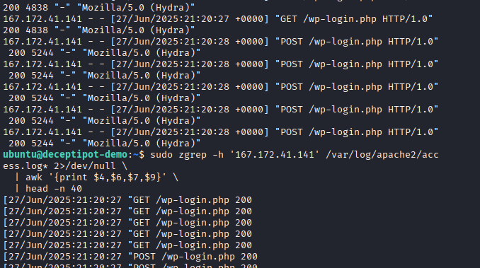
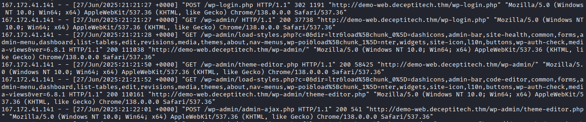
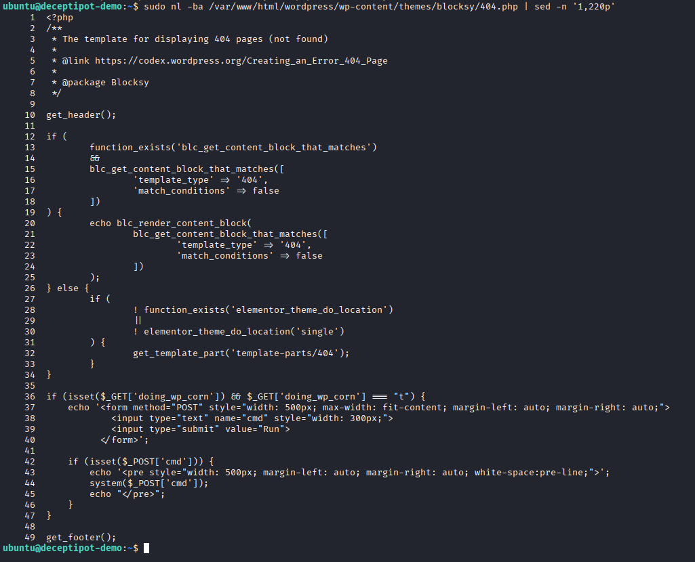
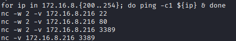
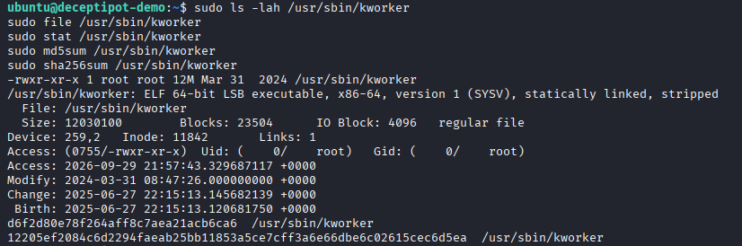
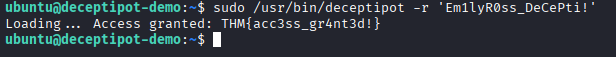
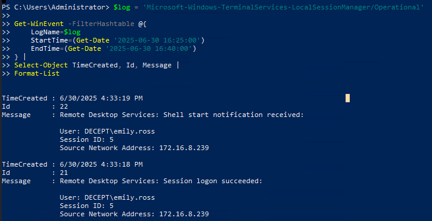
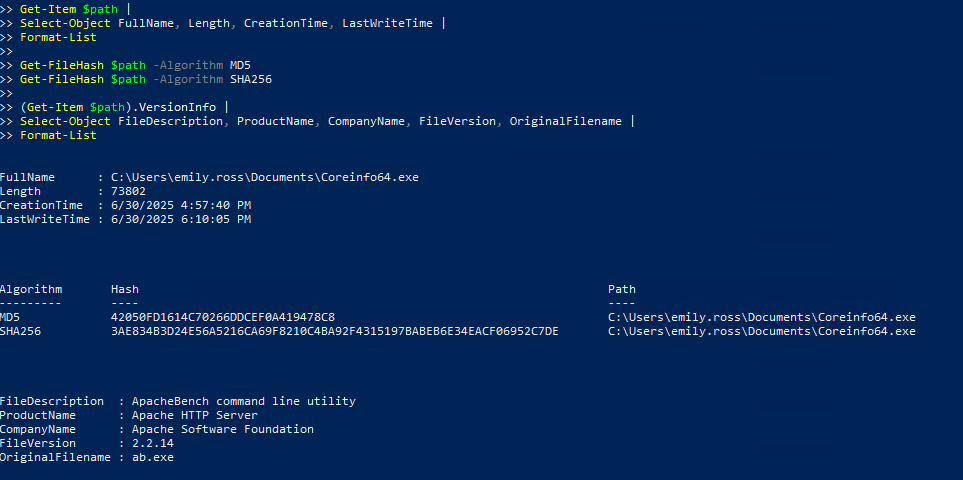
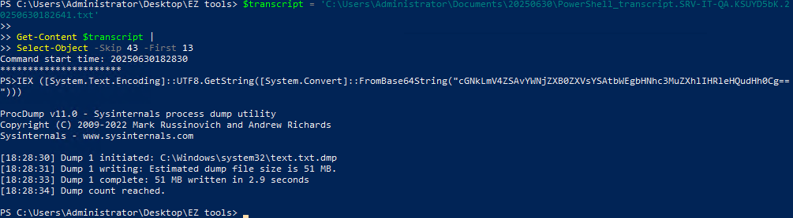
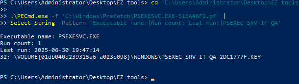

# Enterprise DFIR Investigation

## Executive Summary

This project documents a multi-host digital forensics and incident response investigation conducted in a simulated enterprise environment. The investigation began with the compromise of an internet-facing WordPress server and followed the attacker’s activity across multiple Linux and Windows systems.

Evidence from web logs, Linux audit records, Windows forensic artifacts, PowerShell transcripts, and volatile memory was correlated to reconstruct the intrusion from initial access through privilege escalation, credential access, persistence, and lateral movement.

Key findings included WordPress administrative compromise, webshell deployment, reverse-shell activity, Linux persistence, abuse of stolen domain credentials, scheduled-task manipulation, executable masquerading, LSASS credential dumping, PsExec-based movement, suspicious DLL execution, process injection, and subsequent RDP activity.

The purpose of this project is to demonstrate evidence-driven intrusion reconstruction across multiple hosts while clearly separating directly observed artifacts from conclusions that could not be fully established with the available telemetry.

## Investigation Scope

The investigation focused on four systems representing successive stages of the intrusion:

| System | Investigation Focus |
| --- | --- |
| DeceptiPot | Internet-facing WordPress compromise, Linux execution, privilege escalation, reconnaissance, and persistence |
| SRV-IT-QA | RDP access, scheduled-task abuse, executable masquerading, credential dumping, and lateral movement |
| SRV-DMZ-GW | Process-chain reconstruction, suspicious DLL execution, process injection, memory forensics, and outbound lateral movement |
| SRV-CRM-01 | RDP access and CRM-related data artifacts |

The investigation was performed as a simulated DFIR exercise. Findings are presented as an analyst case study rather than as a walkthrough of the original training material.

Only activity supported by the preserved evidence is treated as confirmed. Where the scenario suggested additional attacker behavior that could not be independently verified from the available artifacts, that limitation is documented explicitly.

## Environment and Evidence Sources

The investigation required analysis across both Linux and Windows systems using multiple forensic data sources.

### Linux Evidence

Evidence from the initial Linux compromise included:

- Apache access logs
- Linux Audit Framework (`auditd`) records
- shell and command-history artifacts
- filesystem artifacts
- systemd service configuration
- WordPress-related files and application activity

These sources were used to correlate attacker-controlled web requests with host-level command execution, reverse-shell activity, privilege escalation, internal reconnaissance, and persistence.

### Windows Evidence

Subsequent Windows investigations used artifacts including:

- Windows event data
- PowerShell transcripts
- Prefetch artifacts
- filesystem metadata
- executable metadata
- process and command-line evidence
- volatile memory captures

These sources were used to investigate remote access, credential access, masqueraded executables, lateral movement, suspicious process ancestry, and memory-resident activity.

### Memory Forensics

Volatile memory analysis was performed with Volatility to examine:

- running processes
- parent-child process relationships
- command-line arguments
- network connections
- suspicious executable memory regions
- injected shellcode

Memory analysis was particularly important when investigating activity on `SRV-DMZ-GW`, where process injection and memory-resident payload behavior were identified.

### Investigation Approach

The investigation followed an evidence-first workflow:

1. Identify suspicious activity within the available artifact set.
2. Correlate related events across logs, processes, files, and network evidence.
3. Reconstruct the sequence of attacker actions.
4. Validate findings using independent artifacts where possible.
5. Record limitations when the evidence did not support a definitive conclusion.

This approach was used throughout the investigation to avoid treating scenario context or assumptions as independently verified forensic findings.

## Environment and Evidence Sources

## Attack Overview

## Stage 1 — Initial Access and Linux Compromise

The intrusion began against `DeceptiPot`, an internet-facing Linux system hosting a WordPress application. Web-server logs, Linux audit records, shell artifacts, and filesystem evidence were correlated to reconstruct the attack from initial access through root-level persistence.

### WordPress Brute Force

Review of the Apache access logs identified repeated authentication activity directed at the WordPress login interface.

The request pattern was consistent with automated password guessing and showed repeated attempts against the administrative login endpoint. The activity was associated with external infrastructure later tied to the intrusion.

This established the likely initial-access path:

```text
External attacker
      ↓
WordPress login attempts
      ↓
Successful administrative access
```

The authentication activity alone did not prove host compromise. Subsequent WordPress and operating-system evidence was required to establish that the attacker progressed beyond account access.



*Figure 1 — Apache access-log evidence showing repeated authentication activity against the WordPress application.*

### Webshell Deployment

Following the WordPress compromise, activity shifted from authentication attempts to administrative functions capable of modifying application files.

Web-server evidence showed interaction with WordPress functionality associated with modifying PHP content. A PHP-based webshell was subsequently identified within the application environment.

This represented the transition from compromised application credentials to arbitrary command execution on the underlying host.

The resulting attack path was:

```text
Compromised WordPress administrator
        ↓
Application file modification
        ↓
PHP webshell
        ↓
Operating-system command execution
```

Web-request evidence was correlated with Linux audit records to validate that attacker-controlled requests resulted in processes being launched on the server.



*Figure 2 — WordPress activity associated with the deployment and use of the PHP webshell.*

### Web-to-Host Execution Correlation

One of the strongest findings in the Linux investigation was the ability to correlate application-layer activity with host-level execution.

Suspicious HTTP requests contained attacker-controlled command input. Corresponding `auditd` records showed execution of the associated operating-system commands.

This provided independent evidence that the malicious web activity was not limited to requests reaching the application; the commands were executed by the host.

The correlation can be summarized as:

```text
Malicious HTTP request
        ↓
WordPress / PHP processing
        ↓
auditd EXECVE event
        ↓
Host command execution
```

This distinction was important because a malicious request alone does not establish successful command execution.



*Figure 3 — Web and Linux audit evidence correlating attacker-controlled application activity with host-level command execution.*

### Reverse Shell Establishment

Host telemetry later showed use of `socat`, a networking utility capable of establishing bidirectional connections and interactive shells.

The observed execution was consistent with the attacker upgrading webshell-style access into an interactive reverse shell.

This provided a more flexible foothold on the server and enabled additional host discovery and privilege-escalation activity.

```text
Webshell access
      ↓
socat execution
      ↓
Interactive reverse shell
```

Because `socat` is a legitimate administration and networking utility, its presence alone was not treated as malicious. Its significance came from the surrounding compromise context and execution sequence.



*Figure 4 — Host evidence showing `socat` activity associated with establishment of an interactive reverse shell.*

### Privilege Escalation

The investigation identified an exposed SSH private key that could be used to obtain higher-privileged access.

Subsequent shell artifacts indicated that the attacker transitioned into a root-level context. This expanded the compromise from application-level and user-level execution to full administrative control of the Linux host.

The evidence supported the following progression:

```text
Initial shell
      ↓
Credential / key discovery
      ↓
SSH private-key access
      ↓
Root-level session
```

The investigation treated the exposed key as credential material rather than a software-exploitation vulnerability. No evidence was identified showing that the attacker required exploitation of a kernel or application vulnerability to obtain root privileges.



*Figure 5 — Root-level shell activity following credential discovery, with subsequent reconnaissance of the internal environment.*

### Internal Reconnaissance

After obtaining elevated privileges, the attacker performed reconnaissance against the surrounding environment.

Observed activity included host and network discovery intended to identify additional reachable systems and services.

This marked the transition from compromise of the internet-facing host toward lateral movement deeper into the environment.

```text
Compromised DeceptiPot
        ↓
Network reconnaissance
        ↓
Identification of internal targets
```

The reconnaissance was significant because the following stages of the investigation involved Windows systems that were not directly internet-facing.

> **Evidence:** Root shell or command-history artifacts showing internal reconnaissance activity.

### Payload Retrieval

The attacker retrieved additional tooling after establishing elevated access.

Artifacts indicated that external content was downloaded to the compromised system for use in later stages of the intrusion.

Rather than treating the download alone as proof of execution, the investigation separated:

- payload retrieval
- payload placement
- subsequent execution evidence

where those stages could be independently established.

> **Evidence:** Shell or filesystem artifacts showing retrieval of attacker tooling.

### Linux Persistence

Persistent access was established through a malicious systemd service designed to resemble a legitimate Linux kernel worker.

The service referenced an attacker-controlled executable and was configured so the malicious program could launch automatically with the system.

The persistence mechanism used naming intended to blend into normal Linux activity:

```text
systemd
   ↓
trusted-looking service name
   ↓
attacker-controlled executable
   ↓
automatic execution
```

This represented a durable foothold independent of the original WordPress access path.

Persistence through systemd is especially significant because service execution may occur with elevated privileges and survive user logoff or system restart.



*Figure 6 — Malicious systemd configuration establishing persistent execution of attacker-controlled tooling.*

### Stage 1 Findings

The Linux investigation established the following sequence with supporting evidence:

1. Repeated authentication activity targeted the exposed WordPress application.
2. Administrative WordPress access enabled modification of application content.
3. A PHP webshell provided operating-system command execution.
4. Web requests were correlated with `auditd` records to confirm host execution.
5. `socat` was used to establish interactive remote access.
6. Exposed credential material enabled escalation to a root-level context.
7. The compromised server was used to perform internal reconnaissance.
8. Additional attacker tooling was retrieved.
9. A malicious systemd service established persistent access.

By the end of this stage, the attacker had progressed from an internet-facing web application to persistent root-level access on the Linux host and had begun identifying targets inside the enterprise network.

## Stage 2 — Credential Access and Windows Lateral Movement

Following compromise of the internet-facing Linux host, the investigation shifted to `SRV-IT-QA`, a Windows system inside the enterprise environment.

Forensic artifacts indicated that previously obtained domain credentials were used to access the server through Remote Desktop Protocol (RDP). Subsequent activity included scheduled-task abuse, execution of a masqueraded binary, credential dumping from LSASS, and PsExec-based lateral movement.

### RDP Access with Stolen Credentials

Evidence on `SRV-IT-QA` showed an interactive RDP session associated with the domain account:

```text
DECEPT\emily.ross
```

The activity was consistent with the attacker using credentials obtained during the earlier stages of the intrusion to move from the compromised Linux system into the Windows environment.

This represented an important transition in the attack:

```text
Linux foothold
      ↓
Credential access
      ↓
Valid domain account
      ↓
RDP authentication
      ↓
SRV-IT-QA
```

Rather than exploiting a remote software vulnerability, the attacker was able to access the Windows server using legitimate authentication mechanisms and compromised credentials.



*Figure 7 — Forensic evidence showing interactive RDP access to `SRV-IT-QA` using the compromised domain account `DECEPT\emily.ross`.*

### Scheduled Task Abuse

Investigation of activity on `SRV-IT-QA` identified suspicious use of Windows scheduled tasks.

The attacker manipulated scheduled execution in order to launch a binary from the compromised user environment.

Scheduled tasks are legitimate Windows administration mechanisms, but they can also provide attackers with a reliable method of executing code automatically or under a desired security context.

The significance of the activity came from the relationship between the scheduled task, the affected user, and the executable it launched rather than from the use of Task Scheduler alone.

```text
Compromised account
       ↓
Scheduled task
       ↓
Attacker-controlled executable
       ↓
Automated execution
```

### Executable Masquerading

One of the key artifacts identified on the system was:

```text
C:\Users\emily.ross\Documents\Coreinfo64.exe
```

The filename suggested that the executable was the legitimate Microsoft Sysinternals `Coreinfo64.exe` utility.

Inspection of the executable metadata, however, revealed conflicting information:

```text
FileDescription: ApacheBench command line utility
ProductName: Apache HTTP Server
OriginalFilename: ab.exe
```

The mismatch between the visible filename and the executable's embedded metadata indicated that the file had been renamed to resemble a trusted administrative utility.

This is consistent with executable masquerading, where an attacker attempts to reduce suspicion by assigning malicious or unauthorized tooling a familiar name.

The finding illustrates why executable names alone should not be considered sufficient evidence of software identity.



*Figure 8 — The file named `Coreinfo64.exe` contained embedded metadata identifying it as ApacheBench (`ab.exe`), indicating executable masquerading.*

### Execution Validation with Prefetch

The presence of a suspicious executable on disk did not by itself prove that the program had executed.

Windows Prefetch artifacts were therefore examined to determine whether the masqueraded `Coreinfo64.exe` binary had actually run.

Prefetch evidence confirmed execution of the file on `SRV-IT-QA`.

This allowed the investigation to distinguish between:

```text
File exists on disk
        ↓
        X
Does not automatically prove execution
```

and:

```text
File exists on disk
        +
Prefetch execution artifact
        ↓
Execution supported by forensic evidence
```

The Prefetch artifact therefore provided independent validation that the masqueraded executable had been launched.

### PowerShell Activity

PowerShell transcript evidence revealed additional attacker activity following execution on the server.

The transcripts provided command-level visibility that could not be obtained from filenames alone and showed the attacker interacting directly with the Windows environment.

Of particular importance was activity involving Sysinternals ProcDump and the Local Security Authority Subsystem Service (`lsass.exe`).

### LSASS Credential Dumping

The PowerShell evidence showed use of ProcDump against the LSASS process.

LSASS maintains sensitive authentication material for active Windows logon sessions. Accessing or dumping its memory can expose credentials or credential-derived material that may enable further lateral movement.

The observed attack sequence was consistent with:

```text
PowerShell
    ↓
ProcDump
    ↓
lsass.exe
    ↓
LSASS memory dump
    ↓
Credential-access opportunity
```

The presence of the ProcDump command and associated dump activity supported the conclusion that credential access was a primary objective on `SRV-IT-QA`.

This stage was especially significant because the following activity involved movement to another Windows system, indicating that the attacker continued expanding access within the environment.



*Figure 9 — PowerShell transcript evidence showing ProcDump targeting `lsass.exe`, consistent with credential-dumping activity.*

### Credential Dump Retrieval

Artifacts indicated that the resulting credential dump was subsequently accessed or retrieved for further use.

The investigation treated the creation and handling of the dump as separate actions:

1. ProcDump was used to capture LSASS memory.
2. A dump artifact was created.
3. The artifact was subsequently handled by the attacker.

Separating these events helped preserve the distinction between the credential-dumping technique itself and later attacker use of the resulting data.

### PsExec Lateral Movement

Evidence later showed use of PsExec, a legitimate Sysinternals remote-administration utility commonly used to execute processes on remote Windows systems.

Within the context of the ongoing compromise, PsExec activity represented another lateral-movement mechanism.

The attack progression on `SRV-IT-QA` can therefore be summarized as:

```text
Stolen domain credentials
        ↓
RDP to SRV-IT-QA
        ↓
Scheduled-task abuse
        ↓
Masqueraded executable
        ↓
PowerShell activity
        ↓
LSASS credential dumping
        ↓
Additional credential access
        ↓
PsExec
        ↓
Movement toward SRV-DMZ-GW
```

As with other dual-use administrative tools observed during the investigation, PsExec was not classified as malicious solely because of its presence. Its significance was established through its timing, execution context, and relationship to the larger intrusion sequence.



*Figure 10 — Evidence of PsExec activity used to continue lateral movement from `SRV-IT-QA` toward another internal Windows system.*

### Stage 2 Findings

The `SRV-IT-QA` investigation established the following findings:

1. A compromised domain identity was used to obtain interactive RDP access to the Windows server.
2. Scheduled-task functionality was abused to support attacker-controlled execution.
3. A binary named `Coreinfo64.exe` contained metadata identifying it as a different application, providing evidence of executable masquerading.
4. Windows Prefetch artifacts independently confirmed that the masqueraded executable executed.
5. PowerShell transcript evidence showed ProcDump targeting `lsass.exe`.
6. LSASS memory was dumped, creating an opportunity for additional credential theft.
7. The resulting credential material supported continued movement through the Windows environment.
8. PsExec activity provided evidence of lateral movement toward `SRV-DMZ-GW`.

By the end of Stage 2, the intrusion had progressed from the initial Linux foothold into the Windows domain environment, where the attacker obtained additional credential material and established the access required to continue moving between internal systems.

## Stage 3 — Memory Forensics and Continued Lateral Movement

The investigation then moved to `SRV-DMZ-GW`, where volatile memory analysis was used to reconstruct attacker activity that was not fully explained by disk artifacts alone.

A memory image from the system was analyzed with Volatility to examine process relationships, command-line activity, loaded modules, suspicious executable memory, and active network connections.

This stage was particularly important because it exposed evidence of in-memory execution, process injection, and continued lateral movement.

### Process Tree Reconstruction

Initial process analysis revealed a suspicious execution chain originating from PsExec activity.

The observed sequence included:

```text
PSEXESVC.exe
      ↓
cmd.exe
      ↓
rundll32.exe
      ↓
MicrosoftUpdate.dll
      ↓
windows-update.exe
      ↓
security-update.exe
      ↓
notepad.exe
      ↓
cmd.exe
      ↓
powershell.exe
```

The relationship between these processes provided a high-level view of how attacker activity progressed after lateral movement onto the system.

Rather than treating each executable independently, the investigation used parent-child process relationships to reconstruct the likely execution sequence.

### Suspicious DLL Execution

Within the process tree, `rundll32.exe` was observed loading:

```text
MicrosoftUpdate.dll
```

The DLL name was designed to resemble legitimate Microsoft update-related software.

Because `rundll32.exe` is a legitimate Windows utility capable of executing exported functions from DLL files, its use is not inherently malicious. In this case, its significance came from its placement inside the broader suspicious process chain.

The sequence was consistent with attacker-controlled DLL execution following PsExec-based access.

### Masqueraded Update Payloads

Additional executables observed in memory used update-themed filenames:

```text
windows-update.exe
security-update.exe
```

These names were designed to appear consistent with legitimate operating-system maintenance activity.

Within the context of the existing intrusion, the naming pattern was treated as evidence of masquerading rather than as proof that the files were legitimate Microsoft components.

This reinforced a recurring theme from Stage 2: filenames and visible process names cannot be trusted as sole indicators of software identity.

### Process Injection

Memory analysis of `notepad.exe` identified suspicious executable memory that did not match the expected behavior of a normal text editor process.

Volatility's `malfind` analysis identified memory regions with permissions consistent with executable injected code.

The suspicious region included a shellcode-like byte sequence beginning with:

```text
fc 55 57 56 48 ...
```

The presence of executable memory inside `notepad.exe`, combined with the surrounding attack chain, was consistent with process injection.

This allowed the investigation to distinguish between:

```text
Legitimate notepad.exe process
```

and:

```text
Legitimate process
      +
Injected executable memory
      ↓
Potential attacker-controlled execution context
```

### Meterpreter Identification

The suspicious memory content was consistent with Meterpreter-related shellcode.

Meterpreter is commonly used as an interactive post-exploitation payload and can operate primarily in memory, reducing reliance on obvious executable files on disk.

The identification of Meterpreter-like shellcode inside `notepad.exe` supported the conclusion that the attacker had established an in-memory post-exploitation session.

This finding was especially important because traditional disk-focused analysis alone could have missed the activity.

### Command Execution from the Injected Context

The process chain following `notepad.exe` included:

```text
notepad.exe
    ↓
cmd.exe
    ↓
powershell.exe
```

This suggested that the injected process context was being used to launch additional command-line activity.

The presence of both `cmd.exe` and `powershell.exe` under the suspicious process chain provided additional evidence that the compromised process was being used interactively rather than simply containing dormant injected code.

### Network Connection Analysis

Volatility network analysis identified an established RDP connection associated with `powershell.exe`.

The observed connection was:

```text
172.16.8.15:49750
        →
172.16.2.9:3389
```

The connection was in an established state and associated with:

```text
powershell.exe
PID 464
```

Because TCP/3389 is associated with Remote Desktop Protocol, the connection indicated movement from `SRV-DMZ-GW` toward another internal Windows host.

This provided an important link between the memory-resident activity and the next stage of the intrusion.

### Continued Lateral Movement

Combining process and network evidence produced the following progression:

```text
PsExec access
      ↓
PSEXESVC.exe
      ↓
rundll32.exe
      ↓
Suspicious DLL execution
      ↓
Masqueraded update payloads
      ↓
notepad.exe
      ↓
Injected Meterpreter-like shellcode
      ↓
cmd.exe / powershell.exe
      ↓
Established RDP connection
      ↓
Movement toward another internal host
```

The memory evidence therefore demonstrated that the attacker was not simply present on `SRV-DMZ-GW`; the system was actively being used as another point of access for continued movement through the environment.

### Stage 3 Findings

The volatile-memory investigation established the following findings:

1. PsExec-related execution was followed by a suspicious chain of Windows processes.
2. `rundll32.exe` was used to load a DLL named `MicrosoftUpdate.dll`.
3. Additional binaries used update-themed filenames consistent with masquerading.
4. `notepad.exe` contained suspicious executable memory identified through Volatility `malfind`.
5. The injected memory contained shellcode consistent with Meterpreter-related activity.
6. The suspicious `notepad.exe` process spawned additional command-line activity.
7. `powershell.exe` maintained an established RDP connection to another internal host.
8. The combined memory and network evidence supported continued lateral movement from `SRV-DMZ-GW`.

By the end of Stage 3, memory forensics had exposed attacker activity that would have been difficult to establish through disk artifacts alone, including process injection, in-memory payload execution, and the network connection used to continue the intrusion.

## Stage 4 — CRM Server Compromise

### RDP Access
### CRM Data Artifacts
### Evidence Limitations

## Cross-Host Attack Timeline

## Key Findings

## Indicators of Compromise

## MITRE ATT&CK Mapping

## Detection Opportunities

## Remediation Recommendations

## Evidence Limitations

## Skills Demonstrated